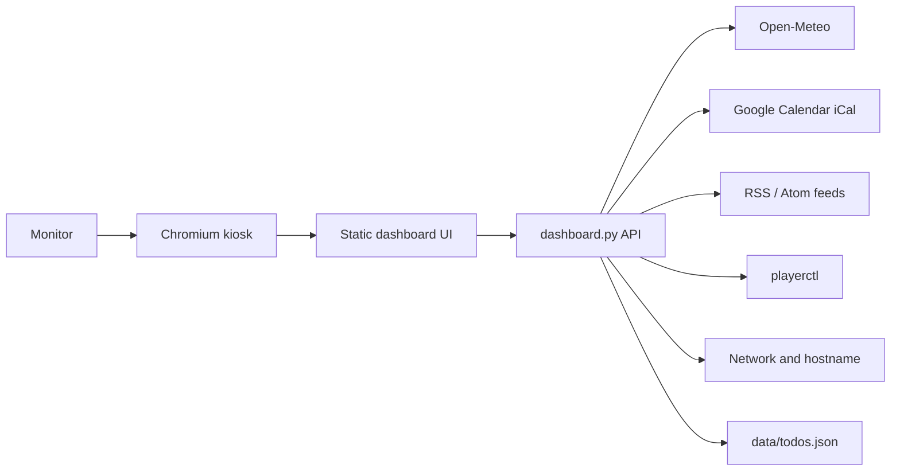

# Architecture

## Overview

Smart Room Dashboard is a small local web application composed of two layers:

- `dashboard.py`: Python standard-library HTTP server and JSON API.
- `web/`: static HTML, CSS, and JavaScript rendered by Chromium.

The server owns integration work. The browser owns presentation work. This keeps secrets and operating-system access out of client-side code and makes the Raspberry Pi kiosk predictable.

Local configuration lives in `config.json`. The file is ignored by Git because it may contain private Google Calendar iCal URLs. If `config.json` is absent, the server falls back to `config.example.json` so the project remains previewable immediately after cloning.

## Runtime Flow

## Server Responsibilities

`dashboard.py` provides these endpoints:

| Endpoint | Purpose |
| --- | --- |
| `/api/health` | Lightweight readiness check. |
| `/api/config` | Public dashboard title, subtitle, timezone, and refresh intervals. |
| `/api/weather` | Current conditions and forecast from Open-Meteo. |
| `/api/calendar` | Upcoming events parsed from configured iCal feeds. |
| `/api/todos` | Local persisted to-do list. |
| `/api/status` | Music and network status. |
| `/api/rss` | Aggregated news items from RSS or Atom feeds. |

The server deliberately avoids persistent background jobs. Each endpoint fetches current data on request. The browser controls polling intervals from `config.json`.

## Frontend Responsibilities

The frontend in `web/app.js`:

- Loads public config.
- Updates the clock every second.
- Polls each module at its configured interval.
- Renders empty, loading, and error states.
- Persists to-do changes through the local API.

The CSS in `web/styles.css` is optimized for:

- 16:9 monitors.
- Raspberry Pi kiosk display.
- Reduced layout shift.
- High contrast from normal room viewing distance.
- Mobile fallback for maintenance from another device.

## Integration Strategy

### Weather

Weather uses Open-Meteo because it has no API key requirement and is stable for unattended devices. The configuration stores only coordinates and display name.

### Calendar

Calendar uses Google Calendar private iCal URLs instead of OAuth. For a wall dashboard, iCal is operationally simpler and avoids refresh-token management. The tradeoff is that private calendar URLs must be treated as secrets.

### Music

Music status uses `playerctl`, which reads Linux MPRIS-compatible media players. Chromium, Spotify clients, VLC, and many Linux audio players can expose metadata this way. If `playerctl` is missing or no player is active, the UI shows a graceful idle state.

### Network

Network status combines:

- Hostname from Python.
- Local IP from a UDP socket probe.
- Wi-Fi SSID from common Linux/macOS commands.
- Online check via TCP connection to the configured host and port.

The default online check is `1.1.1.1:53`.

### To-do Storage

To-dos are stored as JSON in `data/todos.json`. This is intentionally local and human-readable. It is easy to back up, reset, or replace later with a remote task provider.

`data/todos.json` is ignored by Git because it can contain personal task data. The repository includes `data/todos.example.json` as a public template.

## Failure Model

Every external integration is optional. If weather, calendar, RSS, music, or network checks fail, the dashboard continues rendering the remaining modules.

The user interface never assumes configuration is complete. Setup messages are displayed inside the affected panel only.

## Extension Points

Good future additions:

- Home Assistant endpoint.
- MQTT room sensors.
- Spotify Web API with album art.
- Google Tasks or Todoist sync.
- Dedicated admin page for editing `config.json`.
- Display brightness schedule.
- PIR sensor wake/sleep behavior.

Keep extensions behind the Python API boundary so the browser remains a display layer.
